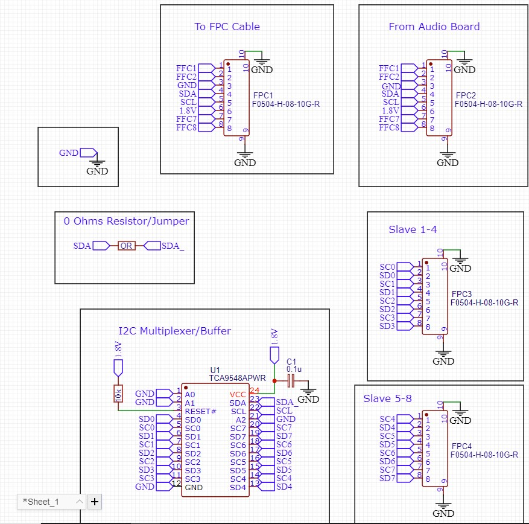

# I2C Multiplexer/Buffer/Signal-Level-Converter mod for Valve's Steam Deck 

This is a project (work in progress) to internally connect additional devices to on Valves Steam Deck via I2C.

### Disclaimer:
This project includes modifications of your hardware and soldering of thin wires and small pads. 
Any attempt to carry out the modification described here is at your own risk.
Please be careful as to not damage your hardware and in consequence yourself or others.
Do not attempt this mod, if you are not competent in soldering and working with electronics.
The Steam Deck contains a Lithium-Polymer battery cell which can be very dangerous if handled improbable (e.g. short circuit).
Always unplug your battery and check for shorts before reconnecting the battery.
I don't take any responsibility or liability for any damages to you, your hardware or anything else.

With that said: good luck and happy tinkering.

## Information on the components used:

- Valve Steam Deck LCD:
   https://www.steamdeck.com

# Rationale

There exist a variety of different Hardware Mods for Valve's Steam Deck like a RGB Mod (https://github.com/WUBBSY/RGBDeck) or a Rumble Mod (https://github.com/dawidmpunkt/rumble-for-steamdeck). To utilize the above mentioned devices, a microcontroller (which is typically used as a central component in those mods) needs to be programmed. Initially, this can be done via an external computer connected to the microcontroller, prior to installation on the steam deck. In order to turn the device on/off or to change functionalities of the mods (e.g. change the color of the RGB-LEDs) the microcontroller needs to receive the corresponding signal. Reddit and Steam-Deck-Discord-User CalcProgrammer1 managed to control the microcontroller via one of the Steam Deck's I2C ports (https://www.reddit.com/r/SteamDeck/comments/10uzoj6/openrgbdeck_lives_rgbdeck_mod_with_jsaux_cover/ and https://gitlab.com/CalcProgrammer1/Arduino_I2C_NeoPixel_Controller). This however requiers solering of tiny components and has a risk of (and did in the mentioned case) damage to the Steam Deck Hardware. 

In this mod I will examine possibilies to connect external devices to the I2C port of the Steam Deck without (or with less) soldering on the Steam Deck Hardware.

# The Mod
On the Steam Deck LCD revision E (silver mainboard cover) one of the I2C ports is accessible via the audio board (Rev. G). The audio board was changed with the later revisions of the mainboard (Revision C, black mainboard cover). 

Luckily Valve did use mostly off-the-shelf components on the Steam Deck (FFC connectors etc).

## Steam Deck LCD (rev. E/silver mainboard cover)
On the Steam Deck, the rev. G audio board is connected to the mainboard via a 14-pin fpc-cable (0.5 mm pin spacing). In the center of the audio board, there is a vertical 8-pin ffc connector (also 0.5 mm pin spacing). The FPC cable, which goes into this connector, runs to the back of the Display and connects to a brightness sensor (?) and two microphones. The FFC connector also provides connections to the I2C port (SDA, SCL, 1.8V and GCD).

We can "hijack" those connections by e.g. an "interconnection board" which will be connected to the vertical FFC-connector on the audio board via an off-the-shelf 8-pin (0.5mm spacing) FFC-cable. The FPC-cable for the microphone/brightness sensor can be connected to an FFC-connector on the interconnection board. The interconnection board will pass through the signals from the audio board to the microphone/brightness sensor FPC-cable. On the interconnection board, a I2C multiplexer is connected to the SDA, SCL, 1.8V and GND lines. Up to eight external devices can be attached to the interconnection board via two 8-Pin FFC-connectors.

A first diagram is pictured in figure 1.

 Figure 1: Schematic diagram of multiplexer

## Steam Deck LCD (rev. C/black mainboard cover)
TBD

## Where to source power?
Solder wires to the battery port and connect it to an LDO with an enable pin. Connect the enable pin to e.g. USB-V+ on one of the daughterboards. This way the external devices will only power on, after the Deck has booted. This should prevent any issues with the Deck not booting. 
